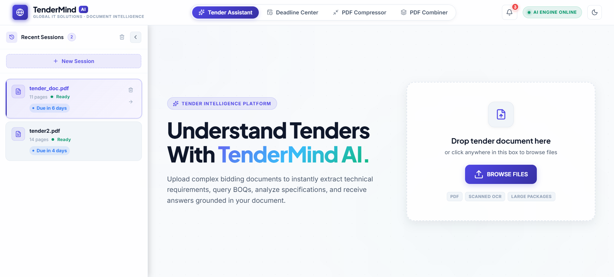
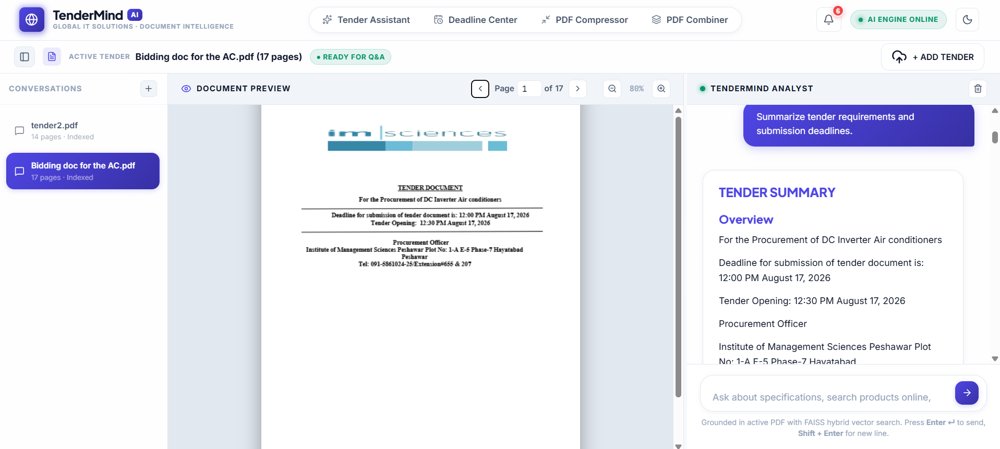
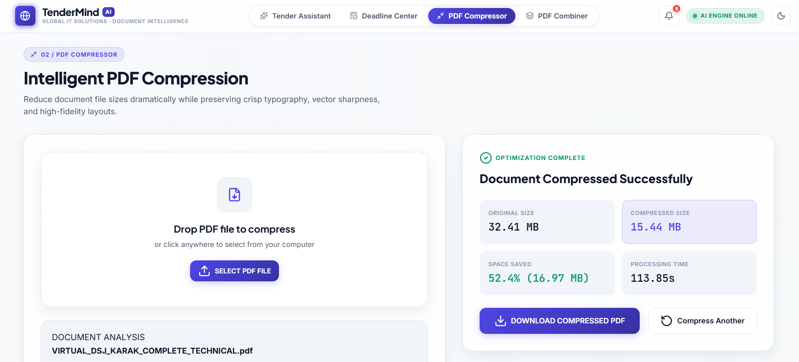
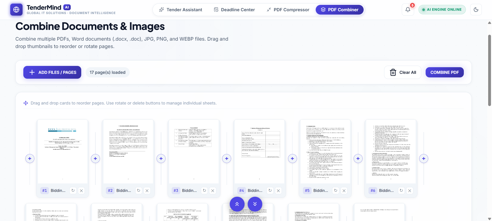
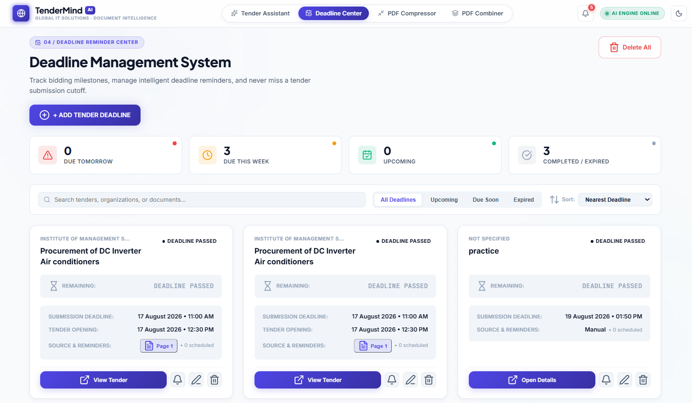
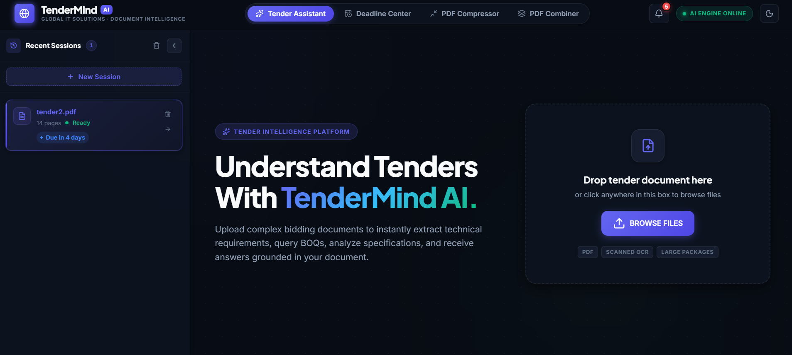

# TenderMind — AI Tender Management & Document Intelligence Platform

> A professional, production-grade web application for AI-powered tender document analysis, intelligent Q&A, equipment extraction, PDF tools, and automated deadline management.

---

## Overview

TenderMind is a comprehensive **Tender Management and AI Assistant** platform designed for procurement officers, bidding teams, and government/corporate organizations. It combines a powerful **RAG-based AI chatbot**, a suite of **PDF tools**, and an **automated deadline reminder system** into a single, unified web application.

Users can upload any government or corporate tender document (PDF), and TenderMind will:

- Instantly analyze and index the document using **Hybrid RAG** (FAISS vector search + BM25 keyword search)
- Answer natural-language questions **strictly from the active document** — never mixing context across documents
- Extract structured information: deadlines, bid security, equipment schedules, delivery terms, eligibility criteria
- Generate clickable **product search links** for equipment items found in the tender
- Compress and combine PDF documents using built-in PDF tools
- Automatically detect tender submission deadlines and schedule **in-app reminder notifications**

---

## Screenshots

> Place your screenshots in the `/images/` directory. Recommended filenames:

### Dashboard / Main Interface


### AI Tender Assistant


### Equipment & Specifications Extraction


### PDF Compressor


### PDF Combiner


### Deadline Reminder System


### Recent Sessions Sidebar


### Dark Mode


### Light Mode


---

## Key Features

### AI Tender Assistant
- Upload and analyze any PDF tender document
- **Hybrid RAG pipeline**: FAISS dense vector search + BM25 keyword search for precise retrieval
- Strict document isolation — chatbot answers only from the currently selected document
- Natural-language question answering with Markdown-formatted responses
- Predefined quick queries: Summarize Requirements, Extract Deadlines, Bid Security, Equipment Schedule
- Source page citations — click to jump directly to the referenced page in the PDF viewer
- Persistent conversation history per document
- Multi-document session management with Recent Sessions sidebar

### Equipment & Product Intelligence
- Automatic extraction of equipment items, quantities, and technical specifications
- One-click product search link generation for each equipment item
- Google product search integration with pre-formatted search queries

### PDF Compressor
- Compress PDF files with configurable quality settings
- Structure and content preservation
- Supports large multi-hundred-page documents
- Instant download of compressed output

### PDF Combiner
- Combine multiple PDFs, images (JPG, PNG), and Word documents (.docx) into a single PDF
- Drag-and-drop page reordering
- Insert pages at any position
- Delete individual pages
- Page thumbnail preview
- Supports files up to 2 GB
- Efficient streaming processing for large documents

### Tender Deadline Reminder System
- Automatic deadline extraction from uploaded tender documents
- In-app notification system with urgency levels (info, warning, urgent, expired)
- Configurable reminder offsets: 7 days, 3 days, 24 hours, 6 hours, 1 hour before deadline
- Timezone-aware deadline tracking (default: Asia/Karachi)
- SQLite-backed persistent reminder storage
- Background scheduler thread checking for due reminders every 20 seconds
- Deadline status lifecycle: ACTIVE → DEADLINE_PASSED

### UI & Experience
- Modern dark/light theme with toggle
- Responsive layout for desktop and tablet
- Real-time document processing progress bar
- Interactive PDF viewer with page navigation and zoom
- Smooth animations and transitions
- Collapsed/expanded Recent Sessions sidebar with session count badge

---

## System Architecture

```
User Browser
    │
    ▼
Flask Web Application (app.py)
    │
    ├── REST API Routes
    │       ├── /api/upload          → PDF ingestion & background processing
    │       ├── /api/chat            → RAG Q&A with strict document scoping
    │       ├── /api/documents/*     → Document session management
    │       ├── /api/pdf/<doc_id>    → PDF viewer streaming
    │       ├── /api/compress        → PDF Compressor
    │       ├── /api/combine         → PDF Combiner
    │       ├── /api/deadlines/*     → Deadline CRUD & notifications
    │       └── /api/product-finder/* → Equipment extraction & search links
    │
    ├── Document Processing Pipeline
    │       ├── services/pdf_analyzer.py      → Page classification (native vs scanned)
    │       ├── services/text_extractor.py    → PyMuPDF + pdfplumber extraction
    │       ├── services/image_preprocessor.py → OpenCV preprocessing
    │       ├── services/ocr_engine.py        → Tesseract OCR
    │       └── services/document_exporter.py → .txt / .docx export
    │
    ├── RAG Pipeline
    │       ├── rag/adapter.py        → Extraction-to-RAG adapter
    │       ├── rag/chunker.py        → Semantic text chunking
    │       ├── rag/embeddings.py     → Sentence-Transformers vector embedding
    │       ├── rag/vector_store.py   → FAISS per-document index
    │       ├── rag/keyword_search.py → BM25 keyword search
    │       └── rag/retriever.py      → Hybrid RRF retriever
    │
    ├── LLM Layer
    │       ├── llm/provider.py  → Multi-provider LLM client (Groq / Gemini / OpenAI)
    │       └── llm/prompts.py   → Structured prompts for all question types
    │
    ├── Document Management
    │       ├── documents/document_manager.py  → Active document tracking
    │       ├── documents/summarizer.py        → Per-document summary caching
    │       └── documents/equipment_parser.py  → Equipment list extraction
    │
    ├── Chat Layer
    │       ├── chat/conversation.py           → Per-document conversation memory
    │       └── chat/product_search_handler.py → Product link generation
    │
    ├── PDF Tools
    │       ├── pdf_tools/compressor.py → PDF compression engine
    │       └── pdf_tools/combiner.py   → Multi-format PDF combiner
    │
    ├── Deadline System
    │       ├── deadlines/database.py   → SQLite schema & CRUD operations
    │       ├── deadlines/extractor.py  → LLM-based deadline extraction
    │       └── deadlines/scheduler.py  → Background reminder daemon
    │
    └── Product Finder
            ├── product_finder/service.py           → Orchestration
            ├── product_finder/equipment_extractor.py → Equipment list extraction
            ├── product_finder/search_provider.py     → Search link generation
            ├── product_finder/matcher.py             → Equipment matching
            └── product_finder/cache.py               → Response caching
```

---

## Technology Stack

| Layer | Technology |
|---|---|
| **Backend Framework** | Python 3.10+, Flask 3.x, Werkzeug |
| **PDF Processing** | PyMuPDF (fitz), pdfplumber |
| **Computer Vision** | OpenCV (cv2), Pillow (PIL) |
| **OCR Engine** | Tesseract OCR, pytesseract |
| **Vector Embeddings** | Sentence-Transformers (all-MiniLM-L6-v2) |
| **Vector Database** | FAISS (faiss-cpu) — per-document isolated indices |
| **Keyword Search** | BM25 (custom implementation) |
| **LLM Providers** | Groq (Llama 3.3 70B), Google Gemini, OpenAI GPT-4o |
| **Document Export** | python-docx |
| **Database** | SQLite (via Python stdlib sqlite3) |
| **Math / Arrays** | NumPy, pandas |
| **Frontend** | HTML5, CSS3 (custom design system), Vanilla JavaScript ES6+ |
| **PDF Viewer** | PDF.js (Mozilla, CDN) |
| **Icons** | Lucide Icons (CDN) |
| **Deployment** | Any Python WSGI host (Railway, Render, VPS, local) |

---

## Project Structure

```
TenderMind/
│
├── app.py                          # Main Flask application & all API routes
├── config.py                       # Environment configuration loader
├── requirements.txt                # Python dependencies
├── .env.example                    # Environment variables template
├── .env                            # Your local configuration (DO NOT COMMIT)
├── .gitignore                      # Git exclusion rules
├── README.md                       # This file
│
├── templates/
│   └── index.html                  # Single-page application template
│
├── static/
│   ├── css/
│   │   └── style.css               # Complete application stylesheet
│   └── js/
│       └── app.js                  # Frontend controller (state, API, UI)
│
├── services/                       # Document processing pipeline
│   ├── pdf_analyzer.py             # Page quality analysis & classification
│   ├── text_extractor.py           # Native text + table extraction
│   ├── image_preprocessor.py       # OpenCV image processing pipeline
│   ├── ocr_engine.py               # Tesseract OCR wrapper
│   └── document_exporter.py        # .txt and .docx export generator
│
├── rag/                            # RAG pipeline modules
│   ├── adapter.py                  # Extraction-to-chunk adapter
│   ├── chunker.py                  # Semantic text chunker
│   ├── embeddings.py               # Sentence-Transformers embeddings
│   ├── vector_store.py             # Per-document FAISS index manager
│   ├── keyword_search.py           # BM25 keyword search
│   └── retriever.py                # Hybrid RRF retriever
│
├── llm/                            # LLM provider abstraction
│   ├── provider.py                 # Multi-provider client (Groq/Gemini/OpenAI)
│   └── prompts.py                  # Structured prompts for all question types
│
├── documents/                      # Document management layer
│   ├── document_manager.py         # Active document state manager
│   ├── summarizer.py               # Cached document summarizer
│   └── equipment_parser.py         # Equipment schedule extractor
│
├── chat/                           # Chat & conversation layer
│   ├── conversation.py             # Per-document conversation memory
│   └── product_search_handler.py   # Product search link generator
│
├── citations/
│   └── citation_manager.py         # Source page citation manager
│
├── pdf_tools/                      # PDF utility tools
│   ├── compressor.py               # PDF compression engine
│   └── combiner.py                 # Multi-format PDF combiner
│
├── deadlines/                      # Deadline reminder system
│   ├── database.py                 # SQLite schema, CRUD, timezone helpers
│   ├── extractor.py                # LLM-powered deadline extraction
│   └── scheduler.py                # Background reminder daemon
│
├── product_finder/                 # Product search intelligence
│   ├── service.py                  # Product finder orchestration service
│   ├── equipment_extractor.py      # Equipment list extraction
│   ├── search_provider.py          # Search link provider
│   ├── matcher.py                  # Equipment-to-product matcher
│   └── cache.py                    # Product search result caching
│
├── images/                         # UI screenshots for documentation
│   └── (place screenshots here)
│
├── uploads/                        # Uploaded PDF storage (runtime, gitignored)
│   └── .gitkeep
│
└── temp/                           # Runtime processing files (gitignored)
    ├── .gitkeep
    ├── vector_stores/              # Per-document FAISS indices
    ├── summaries/                  # Cached document summaries
    ├── thumbnails/                 # PDF page thumbnails
    ├── generated_documents/        # Exported .docx / .txt files
    └── deadlines/                  # SQLite deadline database
```

---

## Installation & Local Setup

### Prerequisites

**1. Python 3.10+**
```bash
python --version   # Must be 3.10 or higher
```

**2. Tesseract OCR** (required for scanned PDF pages)

- **Windows**: Download from [Tesseract at UB Mannheim](https://github.com/UB-Mannheim/tesseract/wiki)
  Default path: `C:\Program Files\Tesseract-OCR\tesseract.exe`
- **macOS**: `brew install tesseract`
- **Linux**: `sudo apt-get install tesseract-ocr tesseract-ocr-eng libgl1-mesa-glx`

**3. A Groq API Key** (recommended — free tier available)
- Sign up at [console.groq.com](https://console.groq.com/)
- Free tier includes: 6,000 tokens/minute on Llama 3.3 70B

---

### Step-by-Step Setup

**1. Clone or download the project**
```bash
git clone <your-repository-url>
cd TenderMind
```

**2. Create a virtual environment**
```bash
python -m venv .venv

# Activate on Windows:
.venv\Scripts\activate

# Activate on macOS/Linux:
source .venv/bin/activate
```

**3. Install dependencies**
```bash
pip install -r requirements.txt
```
> First run will also download the embedding model (~80 MB) automatically.

**4. Configure environment variables**
```bash
cp .env.example .env
```
Open `.env` and set at minimum:
```
GROQ_API_KEY=your_groq_api_key_here
LLM_PROVIDER=groq
LLM_MODEL=llama-3.3-70b-versatile
```

**5. Start the application**
```bash
python app.py
```

**6. Open in browser**
```
http://localhost:5000
```

---

## Production Deployment

### Start Command
```bash
python app.py
```
For production with Gunicorn (Linux/macOS):
```bash
pip install gunicorn
gunicorn -w 2 -b 0.0.0.0:5000 --timeout 300 app:app
```

> **Note:** Use `--timeout 300` because large PDF processing can take time.
> Use 2 workers maximum — the in-memory JOBS dict is process-local.

### Required Environment Variables for Production

| Variable | Required | Description |
|---|---|---|
| `GROQ_API_KEY` | Yes* | Groq LLM API key (*if using Groq provider) |
| `GEMINI_API_KEY` | Yes* | Google Gemini API key (*if using Gemini provider) |
| `OPENAI_API_KEY` | Yes* | OpenAI API key (*if using OpenAI provider) |
| `LLM_PROVIDER` | Yes | One of: `groq`, `gemini`, `openai`, `offline_rag` |
| `LLM_MODEL` | Yes | Model name for chosen provider |
| `FLASK_ENV` | Yes | Set to `production` to disable debug mode |
| `HOST` | No | Bind host (default: `0.0.0.0`) |
| `PORT` | No | Port number (default: `5000`) |
| `EMBEDDING_MODEL` | No | Sentence-Transformers model (default: `all-MiniLM-L6-v2`) |
| `MAX_FILE_SIZE` | No | Max upload size in bytes (default: `52428800` = 50 MB) |
| `COMBINER_MAX_FILE_SIZE` | No | Max combiner upload in bytes (default: `2147483648` = 2 GB) |
| `OCR_DPI` | No | OCR resolution (default: `300`) |
| `OCR_LANG` | No | OCR language code (default: `eng`) |
| `TESSERACT_CMD` | No | Tesseract path on Windows if not in PATH |

---

## Free Deployment Options

### Option 1: Replit (Free)
Replit can host this project with some manual setup:

1. Import the repository into [replit.com](https://replit.com)
2. In the Replit Shell, run: `pip install -r requirements.txt`
3. Install Tesseract: in **replit.nix** add `pkgs.tesseract` and `pkgs.poppler_utils` under `deps`, or use the Packages tab
4. Add your `GROQ_API_KEY` in **Replit Secrets**
5. Set the **Run** command to: `python app.py`
6. Click **Run**

> **Limitations**: Free Replit instances have limited RAM (~512 MB) and sleep after inactivity. The embedding model (~80 MB) plus FAISS indices may strain memory on very large documents.

### Option 2: Railway.app
1. Connect your GitHub repository
2. Add environment variables in Railway dashboard
3. Deploy — Railway auto-detects Python and runs `python app.py`

> Free tier: $5/month credit. Sufficient for light usage.

### Option 3: Render.com
1. Create a new Web Service from your GitHub repository
2. Build command: `pip install -r requirements.txt`
3. Start command: `python app.py`
4. Add environment variables in Render dashboard

> Free tier: service sleeps after 15 minutes of inactivity.

### Option 4: Self-hosted VPS (Recommended for production)
Any VPS with 2+ GB RAM (DigitalOcean, Linode, AWS EC2) running Ubuntu/Debian.

```bash
# Install system dependencies
sudo apt-get update
sudo apt-get install python3-pip tesseract-ocr tesseract-ocr-eng libgl1-mesa-glx poppler-utils -y

# Clone, configure, and run with Gunicorn + systemd service
```

### Important Deployment Notes
| Requirement | Notes |
|---|---|
| **Tesseract OCR** | Must be installed on the host system |
| **Persistent disk/volume** | Required for `uploads/` and `temp/` to survive restarts |
| **RAM** | Minimum 1 GB; 2+ GB recommended for large PDF processing |
| **CPU** | Single-core is fine; multi-core improves large-file processing |
| **Internet access** | Required on first run to download embedding model from HuggingFace |
| **Background threads** | The deadline scheduler runs as a daemon thread — no separate worker needed |

---

## Environment Configuration Reference

| Variable | Required | Default | Purpose |
|---|---|---|---|
| `GROQ_API_KEY` | Yes* | — | Groq LLM API key |
| `GEMINI_API_KEY` | Yes* | — | Google Gemini API key |
| `OPENAI_API_KEY` | Yes* | — | OpenAI API key |
| `LLM_PROVIDER` | Yes | `groq` | Active LLM provider |
| `LLM_MODEL` | Yes | `llama-3.3-70b-versatile` | Model identifier |
| `EMBEDDING_MODEL` | No | `all-MiniLM-L6-v2` | Sentence-Transformers model |
| `FLASK_ENV` | No | `development` | Set to `production` for deployment |
| `HOST` | No | `0.0.0.0` | Server bind address |
| `PORT` | No | `5000` | Server port |
| `MAX_FILE_SIZE` | No | `52428800` | Max RAG upload size (bytes) |
| `COMBINER_MAX_FILE_SIZE` | No | `2147483648` | Max combiner upload size (bytes) |
| `OCR_DPI` | No | `300` | OCR page render resolution |
| `OCR_LANG` | No | `eng` | Default OCR language |
| `TESSERACT_CMD` | No | Auto-detected | Tesseract executable path |

*Provide the key for your chosen `LLM_PROVIDER` only.

---

## External Services

| Service | Purpose | API Key Required | Free Tier | Sign-up URL |
|---|---|---|---|---|
| **Groq** | LLM inference (recommended) | Yes (`GROQ_API_KEY`) | Yes — generous free tier | [console.groq.com](https://console.groq.com/) |
| **Google Gemini** | LLM inference (alternative) | Yes (`GEMINI_API_KEY`) | Yes — free tier available | [aistudio.google.com](https://aistudio.google.com/) |
| **OpenAI** | LLM inference (alternative) | Yes (`OPENAI_API_KEY`) | No — pay-per-use | [platform.openai.com](https://platform.openai.com/) |
| **HuggingFace Hub** | Embedding model download | No | Free | Automatic |

> **Note:** No email service is currently integrated. The deadline system generates in-app notifications only. Email alerts can be added by configuring an SMTP provider (e.g., Resend, SendGrid, Gmail SMTP) using the `RESEND_API_KEY` / `EMAIL_FROM` / `EMAIL_TO` environment variables.

---

## Features in Detail

### AI Tender Assistant

1. **Upload** a PDF tender document (up to 50 MB by default)
2. The system runs a **hybrid extraction pipeline**:
   - Each page is analyzed — native text quality is evaluated
   - High-quality pages: text extracted natively via PyMuPDF and pdfplumber (tables preserved)
   - Low-quality / scanned pages: rendered at 300 DPI, preprocessed with OpenCV, then OCR'd via Tesseract
3. Text is **semantically chunked** and embedded using Sentence-Transformers
4. A **FAISS vector index** + **BM25 keyword index** is built per document
5. When you ask a question:
   - Top-k chunks are retrieved via **Hybrid RRF** (combining dense + sparse search)
   - Retrieved context is sent to the LLM with a **strict prompt** forbidding hallucination
   - Answer is returned with **source page citations**

**Supported quick query types:**
- `summary` — Summarize tender requirements and submission deadlines
- `deadline` — Extract submission deadline, bid opening date
- `bid_security` — Extract earnest money / call deposit / bid security amount
- `equipment_specs` — Extract equipment schedule, quantities, and technical specifications

### PDF Compressor

Upload any PDF and choose compression quality. The compressor:
- Analyzes the file for compressible content
- Resamples embedded images at reduced resolution
- Preserves text, vectors, and document structure
- Outputs a compressed PDF for instant download

### PDF Combiner

Combine multiple files into a single PDF:
- Supported inputs: PDF, JPG, PNG, DOCX
- After upload, all pages appear as **thumbnails**
- **Drag and drop** thumbnails to reorder pages
- Insert pages before the first page or between existing pages
- Delete unwanted pages
- Click **Combine** to generate the final PDF

### Deadline Reminder System

When a tender document is processed:
1. The system automatically runs deadline extraction using the LLM
2. Detected deadlines are saved to a **SQLite database** with timezone awareness
3. Reminders are scheduled at configured offsets (default: 3 days before, 1 day before)
4. A **background daemon thread** checks for due reminders every 20 seconds
5. When a reminder fires, an **in-app notification** appears in the bell icon
6. Expired tenders are automatically marked `DEADLINE_PASSED`

---

## User Guide

### Uploading and Analyzing a Tender

1. Navigate to the **Tender Assistant** tab
2. Click **Upload Tender Document** or drag a PDF onto the upload zone
3. Wait for the processing progress bar to complete (10–120 seconds depending on document size)
4. The workspace opens automatically with the PDF viewer on the left and chat interface on the right

### Asking Questions

Use the **chat input** at the bottom of the workspace, or click any **Quick Query** button:
- "Summarize Tender Requirements & Deadlines"
- "What is the tender deadline for this tender?"
- "What is the earnest money, call deposit or bid security?"
- "Extract Equipment Schedule & Specifications"

### Switching Between Documents

- Previously processed documents appear in the **Recent Sessions** sidebar (left)
- Click any session card to instantly switch — the PDF viewer, chat, and AI context all update
- The AI chatbot always answers from the **currently selected document only**

### Using PDF Compressor

1. Navigate to the **PDF Compressor** tab
2. Upload a PDF file
3. Select compression quality
4. Click **Compress** and download the result

### Using PDF Combiner

1. Navigate to the **PDF Combiner** tab
2. Click **Add Files** or drag multiple PDFs/images/Word documents
3. Reorder page thumbnails as needed
4. Delete unwanted pages using the trash icon
5. Click **Combine** and download the combined PDF

### Managing Deadline Reminders

1. Navigate to the **Deadline Reminders** tab
2. View all detected tender deadlines with urgency status
3. Add manual reminders for external tenders
4. Click the **bell icon** (top right) to view recent notifications
5. Delete individual tenders or use **Delete All** to clear

---

## Troubleshooting

### Application won't start
- Ensure Python 3.10+ is installed: `python --version`
- Ensure all dependencies are installed: `pip install -r requirements.txt`
- Ensure `.env` exists and contains `GROQ_API_KEY` (or your provider's key)

### "No module named 'fitz'" error
```bash
pip install pymupdf
```

### Tesseract not found / OCR fails
- Windows: Install Tesseract from [UB Mannheim](https://github.com/UB-Mannheim/tesseract/wiki) and set `TESSERACT_CMD` in `.env`
- Linux: `sudo apt-get install tesseract-ocr`
- The app works without Tesseract for native-text PDFs — OCR is only used for scanned pages

### LLM returns "API key not configured" error
- Set `GROQ_API_KEY=your_actual_key` in your `.env` file
- Verify `LLM_PROVIDER=groq` is set

### Large PDF processing is slow
- Processing is proportional to document size and page count
- 50-page documents typically take 15–30 seconds
- 200+ page documents can take 1–3 minutes
- Scanned (image-only) PDFs are significantly slower due to OCR

### PDF Combiner fails with very large files
- Ensure `COMBINER_MAX_FILE_SIZE` is set to a sufficient value
- The combiner streams processing to handle files up to 2 GB

### Email alerts not sending
- Email alert sending is not currently integrated by default
- In-app notifications work without any email configuration
- To add email alerts, configure `RESEND_API_KEY` and implement the send logic in `deadlines/scheduler.py`

### Deployment: App crashes with MemoryError
- Increase available RAM on your hosting plan
- Minimum recommended: 2 GB RAM for production use
- Reduce `MAX_FILE_SIZE` to limit document size

---

## Client Handover Checklist

### Delivered Items
- [ ] Complete source code
- [ ] `README.md` with full documentation
- [ ] `.env.example` with all required variables documented
- [ ] `.gitignore` configured for production
- [ ] `requirements.txt` with all dependencies
- [ ] Git repository with initial commit

### Client Configuration Required
- [ ] Obtain **Groq API key** from [console.groq.com](https://console.groq.com/) (free)
  - *Alternative:* Google Gemini or OpenAI key
- [ ] Copy `.env.example` → `.env` and fill in API key(s)
- [ ] Install **Tesseract OCR** on the deployment server
- [ ] Configure persistent disk/volume for `uploads/` and `temp/` directories
- [ ] Set `FLASK_ENV=production` in `.env` for production deployment

### Deployment Steps
1. Clone repository to server
2. Install Python dependencies: `pip install -r requirements.txt`
3. Configure `.env` with production values
4. Start server: `python app.py` or `gunicorn -w 2 -b 0.0.0.0:5000 --timeout 300 app:app`

### Backup Considerations
- **User documents** are stored in `uploads/` — back up regularly if persistence is required
- **Vector indices** are stored in `temp/vector_stores/` — can be regenerated by re-uploading documents
- **Deadline database** is stored in `temp/deadlines/tendermind_deadlines.db` — back up to preserve reminders
- **Conversation history** is stored in `temp/summaries/` — can be cleared without data loss

### Security Notes
- `.env` file must never be committed to source control
- The application does not include user authentication by default — restrict access via reverse proxy (nginx, Caddy) if needed
- Uploaded documents are stored in `uploads/` — ensure this directory has appropriate file system permissions
- The `temp/` directory contains processed documents — apply the same access controls as `uploads/`

---

## License

To be determined by the project owner.

---

## Support & Maintenance

For questions regarding this project, contact the development team.

---

*TenderMind — AI-powered tender intelligence for procurement professionals.*
